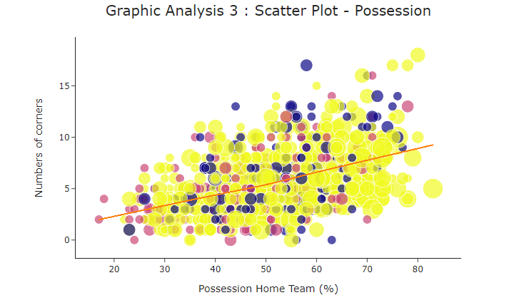

# PredictingFootballGames

PredictingFootballGames is a project to predict result of a Premier League football game using classification algorithms such as SVM or random forest.
Our target variable Y is FTR (Full Time Result). It is a categorical variable (2-Home Win, 1-Away Win, 0-Draw). The database is composed by some features such as shots, shots on target, possession, corners, fouls. Every variable is clearly expained in the .py file. The database is for the english country (Premier League) and is about 3 seasons.

## Requirements

**IMPORTANTS HINTS**

Use [pip](https://pypi.org/project/pip/) to install all requirements: `pip install -r requirements.txt`

  - Preprocessing : keep only numerical variables.
  - SelectKBest : choose the most relevant features.
  - Data viz : important to understand data.
  - Classifiers : Logistic Regression, Random Forrest and SVM.
  - GridSearchCV : for tuning hyperparameters and keep the best combinaison of parameters.
  - Cross Validation : useful to have the best set of train/test sample.
  - NN : keras, Sequenial, Dense, Activation

## Built With

- [plotly](https://plotly.com/python/) - graphs
- [sklearn](https://scikit-learn.org/stable/) - classifiers
- [keras](https://keras.io/) - NN

##  Data Viz.

Graphs have been made with plotly
Make sure to install and import all requirements. Treemap must have issue since a special version of plotly is required.

##  Author and acknowledgment.
  
Developped by Issam Merikhi with the support Yassine Lakhoua as a part of an university project. 
@UDS - University of Strasbourg.

###  License

[The MIT license](https://github.com/IssamMerikhi/PredictingFootballGames/edit/main/LICENSE)
